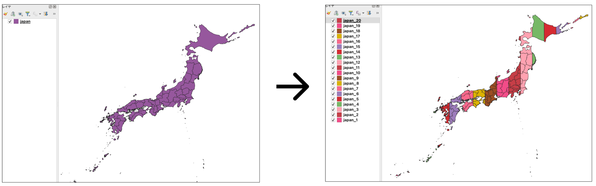
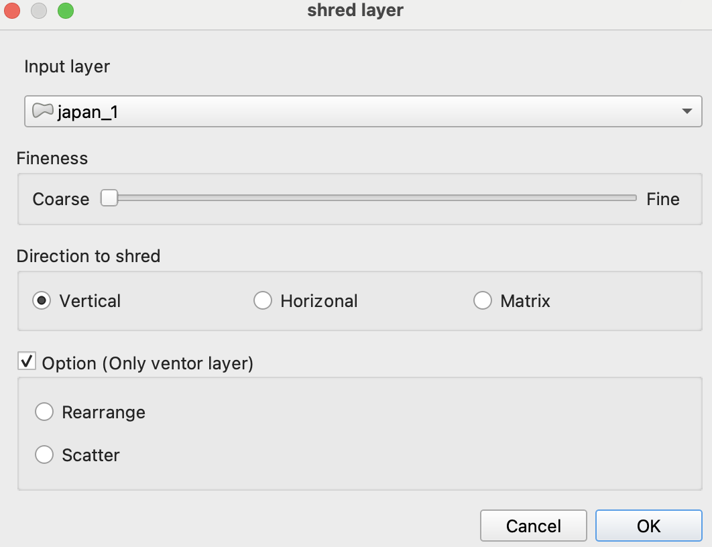
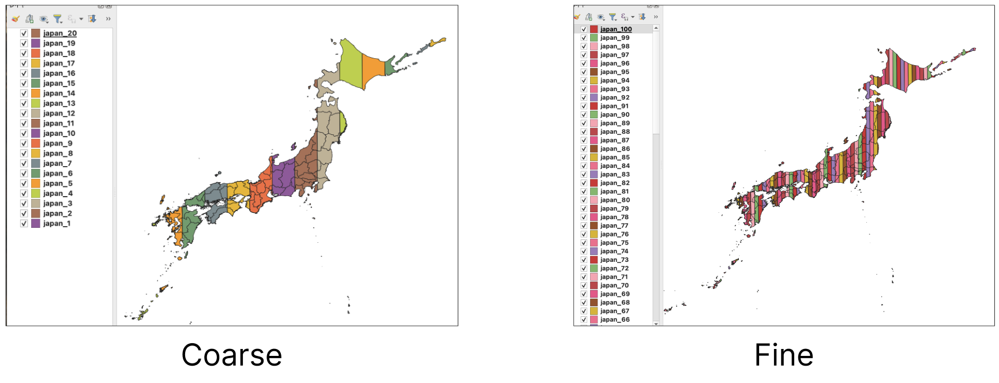
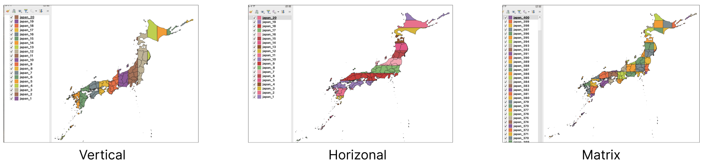
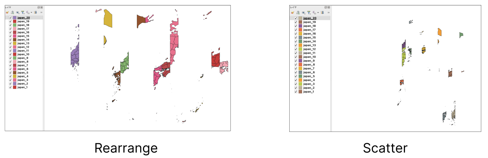

# Shred Layer Plugin

This plugin allows users to "shred" a layer. can be used to delete unnecessary layers or when you do not want to leave evidence. Cut layers can also be scattered on the map

# Usage

- Input layer：Please Select layer you want to trash.
- Fineness：Adjust the shredding level. Choose **Coarse** for 10 pieces or **Fine** for 100 pieces.
- Direction: The direction to shred can be chosen from Vertical, Horizontal, or Matrix (both directions).
- Option: You can rearrange or scatter the shredded pieces (available for vector layers only).

# Attention

The plugin author assumes no responsibility for any important data that may be erased by executing this plugin. Execution is at your own risk.
